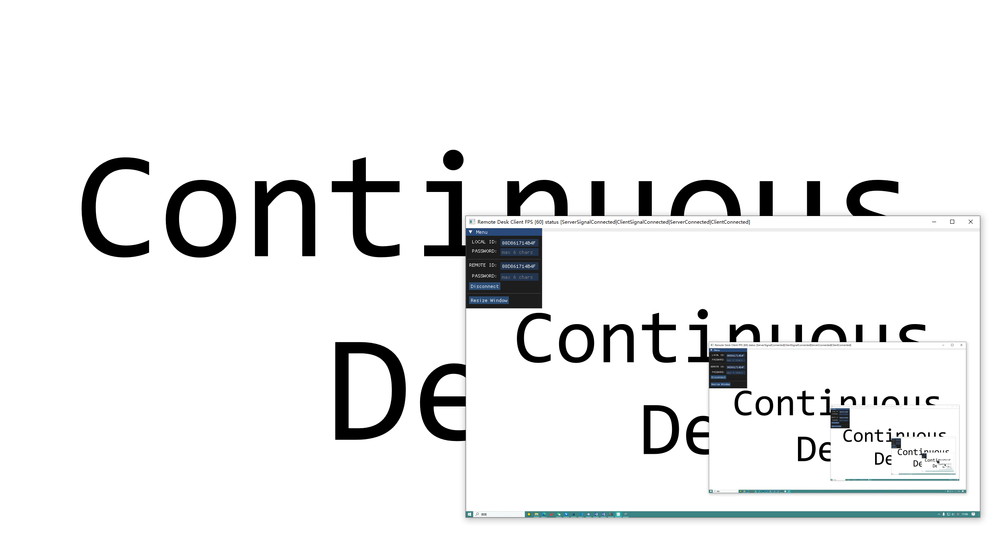

# Continuous Desk

[English](README.md) / [中文](README_CN.md)

Make works continuous

----

----

Continuous Desk 是一个轻量化的跨平台远程桌面软件。它允许多个用户在同一时间远程操控同一台电脑。除桌面图像传输外，它还支持端到端的语音传输，在远程桌面的基础上提供协作能力。

Continuous Desk 是 Projectx 实时音视频传输库的实验性应用。Projectx 是一个轻量化的跨平台实时音视频传输库。它具有网络透传（[RFC5245](https://datatracker.ietf.org/doc/html/rfc5245)），视频软硬编解码（H264），音频编解码（[Opus](https://github.com/xiph/opus)），信令交互，网络拥塞控制（[TCP over UDP](https://libnice.freedesktop.org/)）等基础能力。

其中，视频编解码支持：
- OpenH264 软编软解
- NvCodec  硬编硬解
- FFmpeg   软编软解

----
