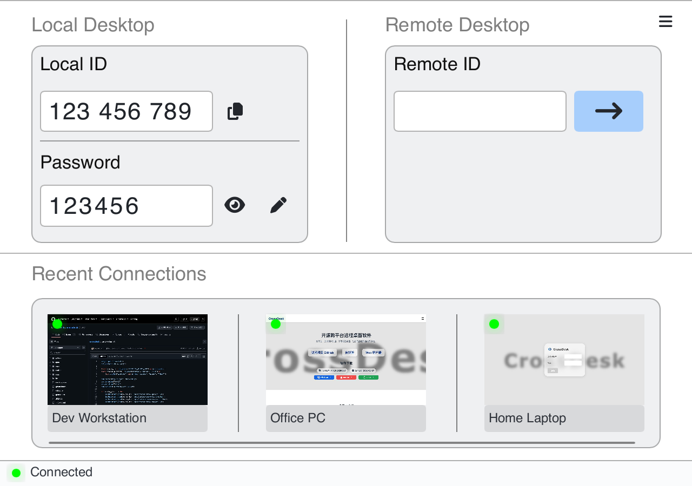
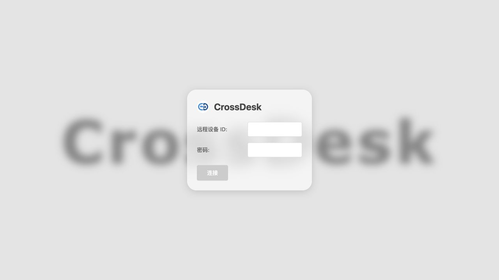
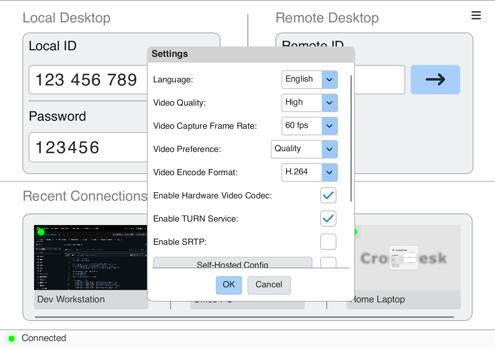

<div align="center">
  
  <h1>CrossDesk</h1>
  <p>A lightweight, cross-platform remote desktop for computers, browsers, and iPhone / iPad.</p>
  <p><a href="https://www.crossdesk.cn/">Website</a> · <a href="https://github.com/kunkundi/crossdesk/releases">Download</a> · <a href="https://web.crossdesk.cn/">Open Web Client</a> · <a href="README.md">中文</a></p>
</div>

<div align="center">

[](#download)
[](https://github.com/kunkundi/crossdesk/releases)
[](https://github.com/kunkundi/crossdesk/actions/workflows/build.yml)
[](LICENSE)
[](https://github.com/kunkundi/crossdesk/stargazers)

</div>

CrossDesk connects Windows, macOS, and Linux desktops, with browser and native iOS clients for controlling computers. Built on [MiniRTC](https://github.com/kunkundi/minirtc), it supports real-time video and audio, keyboard and mouse control, file transfer, and self-hosting. The project is under active development.

> This guide follows the current repository source. Desktop screenshots render the current Slint UI with sample IDs, passwords, online statuses, and recent devices; thumbnails show public pages. Check each release's notes for the features and requirements of its binaries. Native iOS build and signing instructions are below.

[Preview](#preview) · [Download](#download) · [Quick start](#quick-start) · [Session controls](#session) · [Settings](#settings) · [iOS](#ios) · [Self-hosting](#self-hosting) · [Build](docs/BUILD_EN.md) · [FAQ](docs/FAQ.md#english)

<a id="preview"></a>

## Preview

### Desktop client

The main window brings together your device ID, connection password, remote connection entry, and recent devices.

<p align="center">
  
</p>

### Web client

Enter a remote device ID and password in your browser without installing the desktop app on the controlling device.

<p align="center">
  
</p>

See the [screenshot notes](docs/images/README.md) for image sources and refresh instructions.

## Features

| Capability | Current support |
| --- | --- |
| Cross-platform control | Windows / macOS / Linux desktop control; browser and native iOS controllers |
| Live video and audio | H.264 / AV1, 30 / 60 fps settings, hardware codec options, and remote audio; availability depends on hardware and build configuration |
| Devices and displays | Recent connections, device aliases, session tabs, and remote display switching |
| Input and sharing | Keyboard/mouse input, remote cursor synchronization, shortcuts, text clipboard synchronization, and file transfer |
| Networking and deployment | Direct P2P connections, TURN relay, an SRTP encryption option, and self-hosted signaling/relay services |
| Windows protected desktops | CrossDesk Service forwards input on lock screens, sign-in screens, and secure desktops |

Controls and capabilities vary by client. Desktop controls are described below; see the [iOS guide](apps/ios/README.md) for native mobile features.

<a id="download"></a>

## Download and install

Choose a package matching your OS and CPU architecture from [GitHub Releases](https://github.com/kunkundi/crossdesk/releases) or the [website](https://www.crossdesk.cn/).

| Platform | Current source / CI baseline | Installation |
| --- | --- | --- |
| Windows | Windows 10+, x64 | `.exe` installer; portable builds are also supported |
| macOS | macOS 14.0+, Intel / Apple Silicon | x64 or arm64 `.pkg` |
| Linux | Ubuntu 20.04+, amd64 / arm64, glibc 2.31 baseline | `.deb` package |
| iOS / iPadOS | iOS 16.0+, arm64 physical device | Native controller; build and sign with Xcode, or sign the unsigned CI app |
| Web | A WebRTC-capable browser | Open [web.crossdesk.cn](https://web.crossdesk.cn/) |

On Linux, replace the example filename with the downloaded package name:

```bash
sudo apt install "./crossdesk-linux-amd64-<version>.deb"
```

**First launch on macOS:** follow the app prompts to grant **Screen Recording** (called **Screen & System Audio Recording** on newer systems) and **Accessibility** under **System Settings → Privacy & Security**. Reopen the app if prompted. These permissions allow desktop capture and remote keyboard/mouse input respectively.

<a id="quick-start"></a>

## Quick start

### Connect from another computer

1. **Prepare the host.** Install and run CrossDesk on the computer to control. Wait for the bottom status bar to show that the server is connected. Share the **Local ID** and **Password** shown under **Local Desktop** with the controller.
2. **Enter the remote ID.** On the controlling computer, enter the host's ID in **Remote Desktop → Remote ID**, then click **→**.
3. **Verify the password.** Enter the host's current connection password when prompted and confirm. Select **Remember password** if you want to save it.
4. **Reconnect later.** Previously connected devices appear under **Recent Connections**. Reconnect from a card, edit its alias, or remove its record.

The eye button shows or hides the local password; the pencil button changes it. Use **6 ASCII letters or digits** and stay connected to the server while changing it. Wait for the change to succeed and the client to reconnect, then copy the current password. Controllers that saved the old password must enter it again.

### Connect from a browser

1. Keep CrossDesk running and connected to the server on the host computer, with **Enable SRTP** enabled in its Settings.
2. Open the [Web Client](https://web.crossdesk.cn/), enter the **Remote Device ID** and **Password**, and click **Connect**.
3. Use the page's display, mouse-mode, and keyboard controls during the session. Phone and tablet browsers can also connect.

For self-hosting, connect both sides to the same service. Browser deployment is documented in [CrossDesk Web Client](https://github.com/kunkundi/crossdesk-web-client).

<a id="session"></a>

## Session controls

Switch devices using session tabs. Expand the control bar if it is collapsed, and hover over icons to see their tooltips.

| Control | Action |
| --- | --- |
| Display | Switch the remote monitor |
| Keyboard | Send shortcuts; Windows `Ctrl+Alt+Del` requires the remote service |
| Mouse | Enable / release remote mouse control |
| Speaker | Play / mute remote audio |
| Folder | Select a file to send and view transfer progress |
| Network statistics | Inspect traffic, packet loss, frame rate, resolution, and direct / relay mode |
| Fullscreen | Enter / exit fullscreen |
| Disconnect | End the current remote session |

Desktop clients synchronize text clipboard contents. Configure the receiving directory under **Settings → File Save Path**. Closing the main window hides it and keeps the app running; use the system tray or menu-bar exit command to quit completely.

<a id="settings"></a>

## Video and connection settings

Open **☰ → Settings** in the top-right corner and click **OK** to save. Configure the session before connecting; some settings are disabled during an active session. Scroll down for self-hosting, startup behavior, and the file save path.

<p align="center">
  
</p>

| Setting | Purpose |
| --- | --- |
| Video Quality / Video Capture Frame Rate | Low, medium, or high quality and 30 / 60 fps; actual performance depends on the connection and device |
| Video Preference | Choose frame-rate priority, quality priority, or balanced adaptation |
| Video Encode Format | H.264 / AV1; hardware codec availability depends on the platform, device, and build options |
| Enable TURN Service | Allow relay-assisted connections; check this setting if P2P fails |
| SRTP | Media encryption option; configurations on both ends must be compatible |
| Self-Hosted Config | Set the host, signaling port, and TURN port, then enable the checkbox |
| Auto Start / Enable Daemon | Configure startup and process supervision; restart as indicated by the UI |
| File Save Path | Choose where received files are saved |

<a id="ios"></a>

## Native iOS / iPadOS client

[`apps/ios`](apps/ios/README.md) contains a native controller using the same MiniRTC protocol as the desktop client. It controls remote computers; it does not expose an iPhone or iPad as a remotely controlled desktop.

1. Follow the [iOS guide](apps/ios/README.md) to build and sign the app with Xcode, then install it on an iOS 16+ physical device.
2. Enter a remote ID on the home screen, connect, and enter its password. Successful connections become available in the recent devices list.
3. Choose a mouse mode in Settings: **Relative Position** works like a trackpad; **Absolute Position** maps touches directly to the remote screen.
4. Tap the floating icon to expand the menu, then switch displays, open the keyboard, toggle audio, or send files. Received files are stored in `Documents/Received` and can be exported using the share button beside the transfer status.

The app currently receives remote text into the iOS clipboard. Its UI does not yet expose a button to send the local clipboard.

Gestures include one-finger click, two-finger right-click, long-press drag, and pinch-to-zoom. When zoomed in, two-finger panning moves the viewport. The native and browser clients are maintained separately, so their controls and gestures may differ. The current native UI uses Chinese labels.

<a id="windows-service"></a>

## Windows lock screens and sign-in

**CrossDesk Service** (`CrossDeskService`) reports protected desktop states and forwards `Ctrl+Alt+Del`, keyboard, and mouse input on lock screens, sign-in screens, credential prompts, and secure desktops.

The installer registers an on-demand service. CrossDesk tries to start it on launch, and the service exits when no local CrossDesk client is running. Portable builds offer service installation in the prompt or **Settings → Lock Screen Service**, with administrator privileges. The service depends on a running client.

<details>
<summary>Manual deployment and service commands</summary>

Keep the complete installation directory. For manual deployment, place `CrossDesk.exe`, `crossdesk_service.exe`, `crossdesk_session_helper.exe`, and all `.dll` files from the same build together. Open an administrator PowerShell in that directory and run the commands you need:

```powershell
.\CrossDesk.exe --service-install
.\CrossDesk.exe --service-start
.\CrossDesk.exe --service-status
.\CrossDesk.exe --service-ping
# Stop or uninstall the service
.\CrossDesk.exe --service-stop
.\CrossDesk.exe --service-uninstall
```

</details>

If **Remote Windows service unavailable** appears, check installation and service status on the host. Ordinary desktop connections remain available, while control of protected screens is limited.

<a id="self-hosting"></a>

## Self-hosting

Host your own signaling and TURN services, then enter their connection details under **☰ → Settings → Self-Hosted Config**. Enable the same server configuration on both the controller and host.

- [Self-hosting guide](docs/SELF_HOSTING_EN.md): current Compose deployment, client settings, certificate trust, and troubleshooting.
- [CrossDesk Server](https://github.com/kunkundi/crossdesk-server): server source and release configuration.
- [CrossDesk Web Client](https://github.com/kunkundi/crossdesk-web-client): browser source and deployment instructions.

## Development and feedback

- [Build from source](docs/BUILD_EN.md): Windows, macOS, Linux, optional flags, and packaging.
- [iOS development](apps/ios/README.md): native build and physical-device checks.
- [GUI architecture](docs/gui-architecture.md): desktop UI and platform organization.
- [FAQ](docs/FAQ.md#english): connection failures, blank video, received files, and build issues.
- [Report an issue](https://github.com/kunkundi/crossdesk/issues): include both operating systems, client versions, connection mode, and reproduction steps.

## Acknowledgements and license

Thanks to [HelloGitHub](https://hellogithub.com/), [Ruanyf Weekly](https://github.com/ruanyf/weekly), and the [LinuxDo](https://linux.do) community for featuring CrossDesk and contributing feedback.

CrossDesk is licensed under [GPL-3.0](LICENSE). See the [Privacy Policy](PRIVACY.md#english).

### Code signing policy

CrossDesk uses SignPath.io to sign official Windows releases built from this repository.

**Free code signing provided by [SignPath.io](https://signpath.io/), certificate by [SignPath Foundation](https://signpath.org/).**

- **Committers and reviewers:** [kunkundi](https://github.com/kunkundi)
- **Approvers:** [kunkundi](https://github.com/kunkundi)
