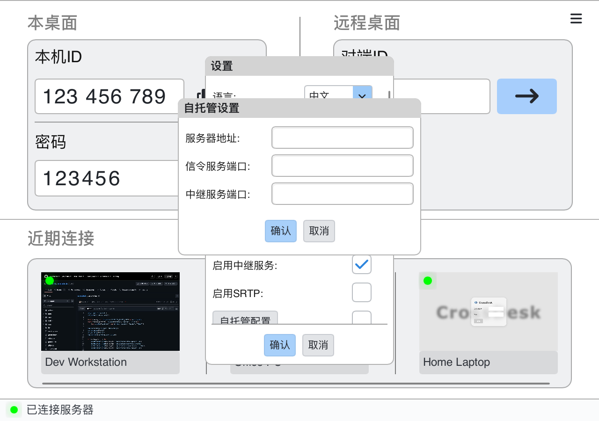

# 自托管服务器

[返回 README](../README.md) · [English](SELF_HOSTING_EN.md)

CrossDesk 的信令服务与 TURN 中继由独立的 [CrossDesk Server](https://github.com/kunkundi/crossdesk-server) 项目维护。本页说明部署入口与当前客户端的配置方法；服务端文件请使用同一 Release 中的配套版本。

## 1. 部署服务端

以下步骤面向已安装 Docker Engine 和 Compose 插件的 Linux 服务器；先确认 `docker compose version` 可用。当前 Compose 使用主机网络，分别运行信令服务和 Coturn。

按 [服务端部署文档](https://github.com/kunkundi/crossdesk-server#运行服务)，从其 [Releases](https://github.com/kunkundi/crossdesk-server/releases) 下载 `compose.yaml` 和 `env.example`，放到同一目录。在该目录执行：

```bash
cp env.example .env
```

用文本编辑器修改 `.env`，至少核对以下内容，填写完成后再启动。完整参数以配套的环境文件为准，也可参考服务端仓库的 [环境变量示例](https://github.com/kunkundi/crossdesk-server/blob/admin-dashboard/.env.example)。

| 配置 | 填写内容 |
| --- | --- |
| `CROSSDESK_IMAGE` | 与下载的配置匹配的固定发布 tag |
| `EXTERNAL_IP` / `INTERNAL_IP` | 服务器真实公网 / 内网 IP；不要直接使用示例地址 |
| `CROSSDESK_SERVER_PORT` | 信令端口，例如 `9099` |
| `COTURN_PORT` | 中继端口，例如 `3478` |
| `MIN_PORT` / `MAX_PORT` | TURN 媒体端口范围 |
| `COTURN_AUTH_SECRET` | 信令服务与 Coturn 的共享密钥；不填入客户端 |
| `COTURN_STATELESS_NONCE_SECRET` | 独立生成、持久保存的 nonce 密钥 |
| `CROSSDESK_DATA_DIR` / `CROSSDESK_LOG_DIR` | 数据、证书和日志的持久化位置 |

两个密钥分别用 `openssl rand -hex 32` 生成。防火墙及云安全组需允许信令端口 TCP、中继端口 TCP/UDP，以及所选媒体端口范围 UDP。容器挂载和网络配置见 [官方 Compose 文件](https://github.com/kunkundi/crossdesk-server/blob/admin-dashboard/compose.yaml)。

保存配置后，校验并启动：

```bash
sudo docker compose config -q
sudo docker compose pull
sudo docker compose up -d
sudo docker compose ps
```

## 2. 配置桌面客户端

使用自签证书时，先按 [证书信任步骤](#3-配置信任证书) 在两端导入根证书，再检查连接状态。

1. 断开现有会话，点击主窗口右上角 **☰ → 设置**。
2. 在设置列表中向下滚动，点击 **自托管配置**。
3. 填写 **服务器地址**、**信令服务端口**、**中继服务端口**，点击“确认”。地址只填主机名或 IP，不加 `https://`、路径或端口。
4. 回到设置窗口，勾选 **自托管配置** 右侧复选框，再点击“确认”保存。
5. 在控制端和被控端执行相同配置。等待两端都显示“已连接服务器”，再使用被控端当前显示的 ID 发起连接。

<p align="center">
  
</p>

切换服务器后请重新核对本机 ID；设备身份与服务端相关，旧服务上的 ID 不应直接套用。

## 3. 配置信任证书

客户端通过 TLS 连接信令服务。证书必须覆盖填写的域名 / IP，且被客户端系统信任。使用受信任 CA 签发的证书时按服务端说明配置证书链；使用自签证书时，需要信任自己部署的根证书。

默认的 [证书生成脚本](https://github.com/kunkundi/crossdesk-server/blob/admin-dashboard/docker/generate_certs.sh) 只将 `EXTERNAL_IP` 写入证书的地址范围；使用这份证书时，客户端应填写该 IP。改用域名需要配置包含该域名的证书。已有证书存在时，[启动脚本](https://github.com/kunkundi/crossdesk-server/blob/admin-dashboard/docker/start.sh) 会复用它们，修改 `.env` 中的 IP 不会自动更新证书。

默认证书文件位于服务端数据目录下的 `certs/`。将自己服务器的 `api.crossdesk.cn_root.crt` 下载到客户端机器，再执行对应平台命令；不要导入来源不明的根证书。

**Windows（管理员 PowerShell）：**

```powershell
certutil -addstore "Root" "C:\path\to\api.crossdesk.cn_root.crt"
```

**Ubuntu / Debian：**

```bash
sudo cp /path/to/api.crossdesk.cn_root.crt /usr/local/share/ca-certificates/
sudo update-ca-certificates
```

**macOS：**

```bash
sudo security add-trusted-cert -d -r trustRoot \
  -k /Library/Keychains/System.keychain /path/to/api.crossdesk.cn_root.crt
```

完成后重新打开客户端。自签证书并不等于没有加密，但根证书信任和主机名校验必须正确配置。

## 4. Web 与 iOS

- **Web：** 按 [Web 客户端项目](https://github.com/kunkundi/crossdesk-web-client) 配置自己的信令连接。浏览器必须信任该服务的证书；不要通过关闭 TLS 校验解决证书错误。
- **iOS：** 在“设置 → 服务器”填写信令服务器、信令端口与 STUN/TURN 端口，然后点击“应用”。自签证书需要在设备上安装对应根证书并启用信任。

## 排查顺序

- **未连接服务器 / TLS 错误：** 先检查地址、信令端口、证书有效期、证书主机名及根证书信任。
- **已连服务器但设备离线：** 确认两端连接同一服务、被控端仍在运行，并重新复制当前 ID。
- **P2P 连接失败：** 检查“启用中继服务”、Coturn 状态、TURN 端口和媒体端口范围，并核对客户端与服务端版本兼容性。
- **配置修改未生效：** 在配置目录重新执行 `sudo docker compose up -d`；单纯重启容器不会应用修改过的环境变量。

日志、备份和迁移操作请参考 [服务端维护说明](https://github.com/kunkundi/crossdesk-server)。
