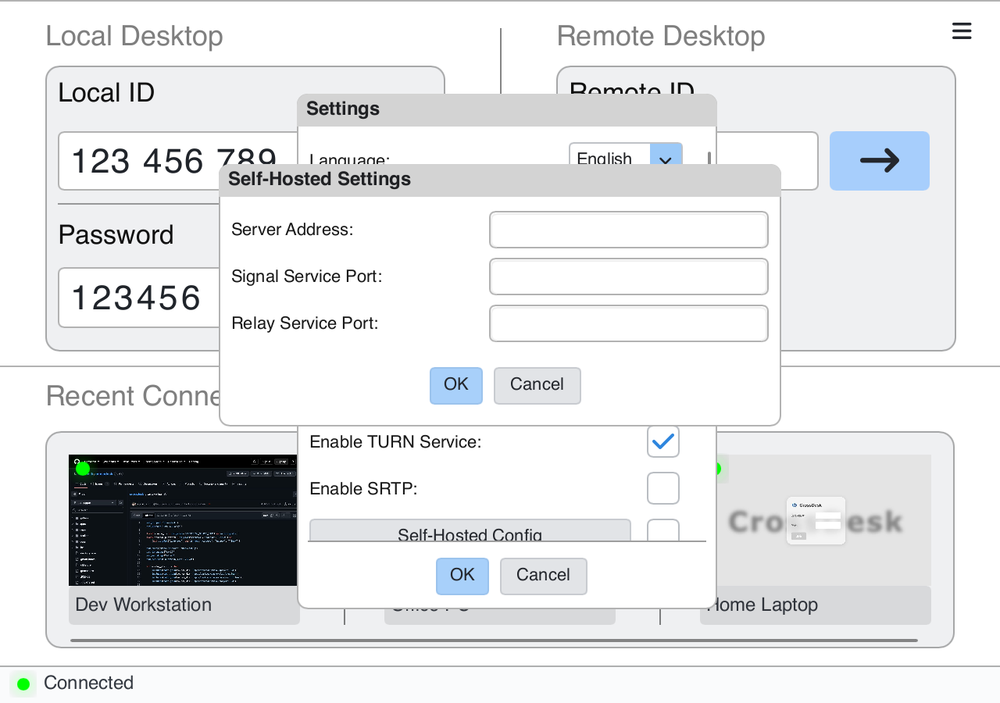

# Self-hosting

[Back to README](../README_EN.md) · [中文](SELF_HOSTING.md)

Signaling and TURN deployment are maintained in [CrossDesk Server](https://github.com/kunkundi/crossdesk-server). Use matching server configuration files from the same release. This guide focuses on deployment entry points and the current client UI.

## 1. Deploy the server

These steps target a Linux server with Docker Engine and the Compose plugin installed. Confirm that `docker compose version` works. The current Compose deployment uses host networking and runs signaling and Coturn separately.

Follow the [server deployment guide](https://github.com/kunkundi/crossdesk-server#运行服务). Download `compose.yaml` and `env.example` from its [Releases](https://github.com/kunkundi/crossdesk-server/releases) into one directory and run there:

```bash
cp env.example .env
```

Edit `.env` in a text editor and complete these values before starting the services. The repository also provides an [environment example](https://github.com/kunkundi/crossdesk-server/blob/admin-dashboard/.env.example).

| Variable | Value |
| --- | --- |
| `CROSSDESK_IMAGE` | A fixed release tag matching the configuration |
| `EXTERNAL_IP` / `INTERNAL_IP` | Your actual public / private server IPs |
| `CROSSDESK_SERVER_PORT` | Signaling port, e.g. `9099` |
| `COTURN_PORT` | Relay port, e.g. `3478` |
| `MIN_PORT` / `MAX_PORT` | TURN media port range |
| `COTURN_AUTH_SECRET` | Secret shared by signaling and Coturn; never enter it in clients |
| `COTURN_STATELESS_NONCE_SECRET` | A separately generated, persistent nonce secret |
| `CROSSDESK_DATA_DIR` / `CROSSDESK_LOG_DIR` | Persistent data, certificate, and log locations |

Generate each secret separately with `openssl rand -hex 32`. Allow signaling TCP, relay TCP/UDP, and the selected media UDP range through the firewall and cloud security group. Mounts and networking are defined in the [official Compose file](https://github.com/kunkundi/crossdesk-server/blob/admin-dashboard/compose.yaml).

After saving the configuration, validate it and start the services:

```bash
sudo docker compose config -q
sudo docker compose pull
sudo docker compose up -d
sudo docker compose ps
```

## 2. Configure desktop clients

For a self-signed deployment, complete the [certificate trust steps](#3-trust-the-tls-certificate) on both clients before checking their connection status.

1. Disconnect existing sessions and open **☰ → Settings**.
2. Scroll down and click **Self-Hosted Config**.
3. Enter **Server Address**, **Signal Service Port**, and **Relay Service Port**, then confirm. Enter only the hostname or IP in the address field, without a URL scheme, path, or port.
4. Enable the checkbox beside **Self-Hosted Config**, then click **OK** in the parent settings window.
5. Configure both the controller and host this way. Once both report a server connection, connect using the host's currently displayed ID.

<p align="center">
  
</p>

Recheck the device ID after changing servers. Device identities belong to their server; do not assume an old ID carries over.

## 3. Trust the TLS certificate

The signaling certificate must cover the configured hostname/IP and be trusted by the client OS. For a public CA certificate, configure the server's certificate chain as instructed by the server project. For a self-signed deployment, trust the root certificate belonging to your own server.

The default [certificate generator](https://github.com/kunkundi/crossdesk-server/blob/admin-dashboard/docker/generate_certs.sh) includes only `EXTERNAL_IP` in the certificate's subject alternative name. Use that IP in the client, or supply a certificate covering your custom domain. The [startup script](https://github.com/kunkundi/crossdesk-server/blob/admin-dashboard/docker/start.sh) reuses existing certificates; editing the IP in `.env` does not update them automatically.

Default certificates are stored in the data directory's `certs/` folder. Copy your server's `api.crossdesk.cn_root.crt` to the client and run the relevant command. Do not trust a root certificate from an unknown source.

**Windows — administrator PowerShell:**

```powershell
certutil -addstore "Root" "C:\path\to\api.crossdesk.cn_root.crt"
```

**Ubuntu / Debian:**

```bash
sudo cp /path/to/api.crossdesk.cn_root.crt /usr/local/share/ca-certificates/
sudo update-ca-certificates
```

**macOS:**

```bash
sudo security add-trusted-cert -d -r trustRoot \
  -k /Library/Keychains/System.keychain /path/to/api.crossdesk.cn_root.crt
```

Reopen the client afterwards. Self-signed certificates still support encryption; correct root trust and hostname verification are required.

## 4. Web and iOS

- **Web:** configure your signaling endpoint following the [Web Client project](https://github.com/kunkundi/crossdesk-web-client). The browser must trust its certificate; do not disable TLS verification to work around certificate errors.
- **iOS:** enter the signaling host, signaling port, and STUN/TURN port under **Settings → Server**, then apply. A self-signed deployment requires installing and trusting its root certificate on the device.

## Troubleshooting order

- **Server disconnected / TLS error:** check the host, signaling port, certificate dates, certificate hostname, and root trust.
- **Server connected, device offline:** confirm both clients use the same server, keep the host running, and copy its current ID again.
- **P2P failed:** check the relay setting, Coturn status, relay/media ports, and compatibility between client and server versions.
- **Environment changes ignored:** run `sudo docker compose up -d` from the configuration directory. Restarting existing containers alone does not apply changed environment variables.

See the [server maintenance documentation](https://github.com/kunkundi/crossdesk-server) for logs, backups, and migration.
